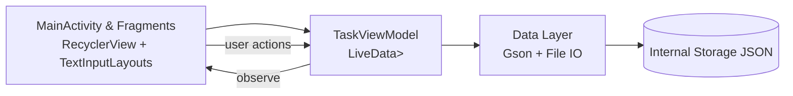

# TaskFlow — Android Task Manager (MVVM + LiveData)


A modern Android app for **creating, editing, completing, sorting, and searching tasks**. The project emphasizes clean UX with **Material Design**, a reactive data layer using **LiveData**, and a maintainable **MVVM** architecture. Tasks persist between sessions via **Gson → JSON** in internal storage, with **Kotlin Coroutines** moving IO off the main thread. Core flows and edge cases are covered by **Espresso** UI tests.

## Table of Contents
- [Features](#features)
- [Screens](#screens)
- [Architecture](#architecture)
- [Data Model](#data-model)
- [Core Components](#core-components)
- [Data Persistence](#data-persistence)
- [Validation & Feedback](#validation--feedback)
- [Search & Sort](#search--sort)
- [Testing](#testing)
- [Project Structure](#project-structure)
- [Requirements](#requirements)
- [Quick Start](#quick-start)
- [Usage](#usage)
- [Performance Notes](#performance-notes)
- [Development Highlights](#development-highlights)
- [Roadmap](#roadmap)
- [License](#license)

## Features
- **CRUD on tasks**: add, view, edit, delete.
- **Mark complete** with immediate visual feedback (strike-through).
- **Live search** on name/description (TextWatcher).
- **Sort** by *Alphabetical* or *Creation Date* (AlertDialog fragment).
- **Reactive UI** with `LiveData<List<TaskItem>>` updating RecyclerView automatically.
- **Persistent storage** using Gson to serialize/deserialize tasks to JSON in internal storage.
- **Async file IO** with Coroutines (`Dispatchers.IO`) to keep the UI smooth.
- **Material Design** styling via `colors.xml` and `styles.xml`.
- **UI instrumentation tests** (Espresso) for navigation and core flows.
- **Debug logs** sprinkled at critical operations (add, toggle, delete, sort).

## Screens
- **Main / Task List**: RecyclerView of CardViews with title, description, info and complete buttons, search field, and a FAB to add tasks.
- **New Task Fragment**: TextInputLayouts for name and description; validates before saving.
- **Edit Task Fragment**: Edit or delete existing tasks.
- **Sort Dialog**: Choose *Alphabetical* or *Creation Date*.
> Add exported images to make the README visual:
> - `images/main.png`
> - `images/new_task.png`
> - `images/edit_task.png`
> - `images/sort_dialog.png`

## Architecture
MVVM keeps responsibilities clean: UI observes state and delegates actions; ViewModel owns data and business logic; a small data layer handles JSON IO.



## Data Model
```kotlin
data class TaskItem(
  val id: Long = System.currentTimeMillis(),
  var name: String,
  var description: String = "",
  var isCompleted: Boolean = false,
  val createdAt: Long = System.currentTimeMillis(),
  var originalPosition: Int = 0 // used for stable sort by creation
)
```

## Core Components
- **MainActivity** — hosts list UI, search box, sort button, and “New Task” FAB; observes `taskList` LiveData.
- **TaskViewModel** — single source of truth: `LiveData<List<TaskItem>>`, operations for add/update/delete/toggle, and save/load to disk.
- **TaskAdapter** — binds `TaskItem` to RecyclerView CardViews; handles complete/info clicks.
- **NewTaskFragment** — create flow with validation; on success, delegates to ViewModel then dismisses.
- **TaskEditFragment** — edit/delete actions for a selected task.
- **SortDialogFragment** — returns user’s sort choice to MainActivity.

## Data Persistence
**Where**: Internal app storage  
**Format**: JSON via **Gson**  
**How**: Coroutines offload IO; UI updates posted back on the main thread.

```kotlin
// ViewModel sketch
private val gson = Gson()
private val filename = "tasks_data.json"
val taskList = MutableLiveData<MutableList<TaskItem>>(mutableListOf())

fun addTask(task: TaskItem) {
  val cur = taskList.value ?: mutableListOf()
  task.originalPosition = cur.size
  cur.add(task)
  taskList.value = cur
  saveTasks() // fire-and-forget (errors logged)
}

private fun saveTasks() = viewModelScope.launch(Dispatchers.IO) {
  val json = gson.toJson(taskList.value ?: emptyList<TaskItem>())
  app.openFileOutput(filename, Context.MODE_PRIVATE).use { it.write(json.toByteArray()) }
}

fun loadTasks() = viewModelScope.launch(Dispatchers.IO) {
  val json = runCatching {
    app.openFileInput(filename).bufferedReader().readText()
  }.getOrElse { "[]" }
  val type = object : TypeToken<MutableList<TaskItem>>() {}.type
  val loaded = gson.fromJson<MutableList<TaskItem>>(json, type)
  withContext(Dispatchers.Main) { taskList.value = loaded }
}
```

## Validation & Feedback
- **Validation**: task name required; duration/extra inputs not used here.
- **Snackbar**: inline, contextual error hints (e.g., “Task name cannot be empty”).
- **Toast**: brief confirmations (saved, deleted, canceled).
- **Reordering**: completed tasks drift to the bottom for clarity.

## Search & Sort
**Search** — `TextWatcher` filters adapter items in real time (case-insensitive on name + description).  
**Sort** — AlertDialog offers:
- **Alphabetical**: `current.sortBy { it.name.lowercase() }`
- **Creation Date**: `current.sortBy { it.originalPosition }`

Adapter refreshes immediately after ViewModel updates the list.

## Testing
Espresso tests automate the key user journeys.

```kotlin
@Test fun addTask_showsInList() {
  onView(withId(R.id.fabNewTask)).perform(click())
  onView(withId(R.id.inputName)).perform(typeText("Test Task"))
  onView(withId(R.id.inputDesc)).perform(typeText("Details"))
  onView(withId(R.id.saveButton)).perform(click())
  onView(withText("Test Task")).check(matches(isDisplayed()))
}

@Test fun navigate_fragments_and_delete() {
  onView(withId(R.id.infoButton)).perform(click())           // open edit
  onView(withId(R.id.deleteButton)).perform(click())         // delete
  onView(withId(R.id.recyclerView)).check(matches(isDisplayed()))
}
```

Logged checkpoints (e.g., add, toggle, sort) aid debugging during tests.

## Project Structure
```text
/app
  src/main/java/...
    ui/
      MainActivity.kt
      NewTaskFragment.kt
      TaskEditFragment.kt
      SortDialogFragment.kt
      TaskAdapter.kt
    data/
      TaskViewModel.kt
      TaskItem.kt
    util/
      // optional helpers (formatting, extensions)
  src/androidTest/java/...   # Espresso tests
  src/main/res/
    layout/                  # activity_main.xml, fragment_new_task.xml, fragment_task_edit.xml, item_cell.xml
    values/                  # colors.xml, styles.xml, strings.xml
    drawable/                # icons/images
```

## Requirements
- Android Studio (latest stable)
- Kotlin + Gradle (bundled)
- Android SDK + emulator or device

## Quick Start
```bash
git clone https://github.com/your-username/taskflow-android.git
cd taskflow-android
# Open with Android Studio → Build → Run
```

## Usage
1. Launch the app and tap **New Task** to create one.
2. Use the **search** bar to filter tasks instantly.
3. Tap **Sort** to order by *Alphabetical* or *Creation Date*.
4. Tap the **check** icon on a card to mark complete; completed tasks move to the bottom.
5. Tap the **info** icon to edit or delete.

## Performance Notes
- **Coroutines** move JSON read/write to `Dispatchers.IO` to keep the UI thread responsive.
- **LiveData** ensures changes in the ViewModel propagate to the UI without manual refreshes.
- RecyclerView item layouts are kept light (CardView + a few controls) for smooth scrolling.

## Development Highlights
- MVVM refactor increased maintainability and testing clarity.
- Introduced **file persistence with Gson**, validated via manual + automated tests.
- Implemented **TextWatcher** search and **AlertDialog** sorting logic.
- Wrote **Espresso** tests for add/edit/delete/navigation; enhanced with debug logs.
- Documented color/style tokens in `colors.xml` / `styles.xml` for theming consistency.

## Roadmap
- Stronger validation rules (e.g., min/max lengths, duplicate detection).
- Room database with migrations and test fakes.
- State restoration and list diffing with `ListAdapter` + `DiffUtil`.
- Animations and MotionLayout transitions.
- Optional sign-in to sync tasks (Firebase/Backend).

## License
MIT
